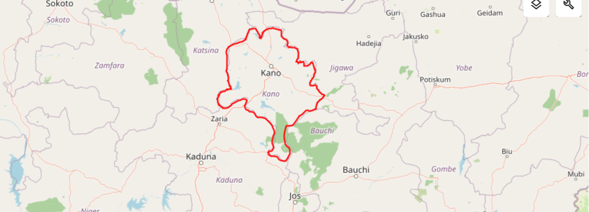
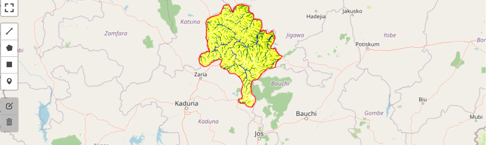
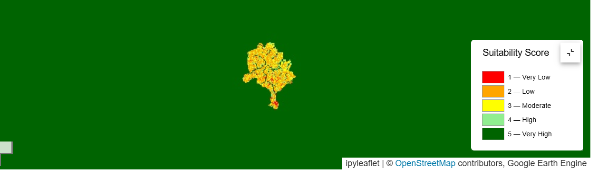
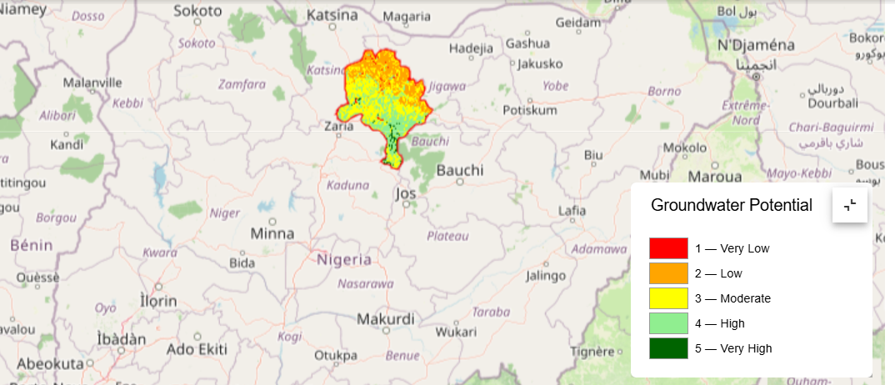

# Groundwater Potential Mapping for Kano State, Nigeria

This repository contains a Google Earth Engine (GEE) workflow for groundwater potential mapping in Kano State, Nigeria.

The project applies a GIS-based Multi-Criteria Decision Analysis (MCDA) approach to integrate seven groundwater-potential criteria: rainfall, elevation, slope, land cover, soil texture, drainage density, and Topographic Wetness Index (TWI).

The thematic layers are processed, reclassified to a common 1–5 suitability scale, weighted using the Analytic Hierarchy Process (AHP), and combined through a weighted overlay to generate a Groundwater Potential Index (GWPI) and five groundwater-potential classes.

---

## Overview

The project:

- Defines Kano State as the Area of Interest (AOI).
- Prepares seven thematic layers relevant to groundwater potential:
  - Rainfall
  - Elevation
  - Slope
  - Land Cover
  - Soil Texture
  - Drainage Density
  - Topographic Wetness Index (TWI)
- Uses Google Earth Engine datasets to process and analyse the thematic layers.
- Clips the datasets to Kano State.
- Resamples the thematic layers to a common spatial resolution.
- Reclassifies the thematic layers to a 1–5 groundwater-suitability scale.
- Uses the Analytic Hierarchy Process (AHP) to determine criterion weights.
- Checks the consistency of the AHP pairwise-comparison matrix.
- Performs a weighted overlay to calculate the Groundwater Potential Index.
- Classifies the resulting GWPI into five groundwater-potential zones:
  - Very Low
  - Low
  - Moderate
  - High
  - Very High
- Identifies High and Very High groundwater-potential areas as priority zones for further investigation and development.
- Provides export functions for raster and vector outputs.

---

## Study Area

The analysis focuses on **Kano State, Nigeria**.

The administrative boundary for the study area is obtained from the FAO Global Administrative Unit Layers (GAUL) dataset in Google Earth Engine.

All thematic datasets are clipped to the Kano State boundary before further analysis.

### Spatial Reference and Resolution

The analysis uses:

- **Coordinate Reference System:** WGS 84 / UTM Zone 32N
- **EPSG:** 32632
- **Target spatial scale:** 30 m

---

## Data Sources

| Dataset | Purpose |
|---|---|
| FAO GAUL | Kano State administrative boundary |
| NASA SRTM | Elevation and slope |
| ESA WorldCover 2021 | Land cover |
| OpenLandMap | Soil texture |
| CHIRPS Daily | Rainfall |
| MERIT Hydro | Drainage and hydrological variables |
| MERIT DEM | Terrain information used in TWI calculation |

---

## Methodology

The groundwater-potential mapping workflow consists of the following major stages:

```text
Data Acquisition
       ↓
Pre-processing
       ↓
Thematic Layer Preparation
       ↓
Reclassification to 1–5
       ↓
AHP Pairwise Comparison
       ↓
AHP Weight Calculation
       ↓
Consistency Check
       ↓
Weighted Overlay
       ↓
Groundwater Potential Index
       ↓
Five Groundwater Potential Classes
       ↓
Priority Area Identification

---

### 1. Elevation and Slope

Elevation is obtained from the NASA SRTM Digital Elevation Model (DEM).

Slope is derived from the DEM using Google Earth Engine terrain functions.

Elevation and slope are used as topographic factors in assessing groundwater potential. The slope layer is reclassified to a 1–5 suitability scale, with gentler slopes receiving higher suitability scores in the model.

### 2. Land Cover

ESA WorldCover 2021 is used to represent land-cover conditions across Kano State.

The land-cover classes are reclassified according to their relative groundwater suitability and converted to a common 1–5 suitability scale.

### 3. Soil Texture

Soil texture data is obtained from OpenLandMap using the USDA soil texture classification.

The selected soil texture layer is reclassified to a 1–5 groundwater-suitability scale based on the relative suitability of the soil classes.

### 4. Rainfall

Daily precipitation data from the CHIRPS dataset is used to estimate rainfall across the study area.

Annual precipitation totals are calculated for the period 2014–2023 and averaged to obtain mean annual precipitation.

Rainfall values are then reclassified into five suitability classes, with higher rainfall receiving higher groundwater-suitability scores.

### 5. Drainage Density

MERIT Hydro upstream drainage-area data is used to derive an approximate drainage-density surface.

A flow-accumulation threshold of 100 km² is used to identify stream pixels. Drainage density is then approximated within a 5 km circular neighbourhood using the MERIT Hydro spatial resolution.

Lower drainage density is assigned higher groundwater suitability because lower drainage density is assumed to provide greater infiltration opportunity relative to surface runoff.

### 6. Topographic Wetness Index (TWI)

The Topographic Wetness Index (TWI) is derived as a topographic wetness proxy using MERIT Hydro upstream drainage area and MERIT DEM slope.

The TWI is used as an indicator of relative moisture accumulation and potential water availability.

The calculation is represented as:
TWI = ln(flow accumulation / tan(slope))

Higher TWI values are assigned higher groundwater-suitability scores.

---

## Reclassification

All seven thematic criteria are converted to a common suitability scale from 1 to 5:

| Score | Suitability |
| ----: | ----------- |
|     1 | Very Low    |
|     2 | Low         |
|     3 | Moderate    |
|     4 | High        |
|     5 | Very High   |

Different reclassification approaches are used depending on the thematic variable.

Rainfall and drainage density use percentile-based classification.
Elevation, slope, and TWI use predefined thresholds.
Land cover and soil texture use class-based suitability assignments.

The resulting layers are standardized before the weighted overlay.

---

## Analytic Hierarchy Process (AHP)

The Analytic Hierarchy Process (AHP) is used to determine the relative importance of the seven groundwater-potential criteria.

A pairwise-comparison matrix is constructed to compare the criteria, and the principal eigenvector is used to derive the normalized criterion weights.

| Criterion        | Weight |
| ---------------- | -----: |
| Rainfall         | 21.25% |
| Soil Texture     | 21.25% |
| TWI              | 20.34% |
| Land Cover       | 11.61% |
| Drainage Density | 11.61% |
| Elevation        |  7.45% |
| Slope            |  6.49% |

The weights sum to 100%.

---

## AHP Consistency Check

The consistency of the pairwise-comparison matrix is assessed using the Consistency Index (CI) and Consistency Ratio (CR).

The calculated Consistency Ratio is:

CR = 0.0139

This is below the commonly accepted threshold of 0.10, indicating that the pairwise comparisons used to derive the criterion weights are acceptably consistent.

---

## Weighted Overlay

The seven reclassified thematic layers are combined using a weighted linear combination.

The Groundwater Potential Index (GWPI) is calculated as:
GWPI = Σ (Suitability Score × AHP Weight)

Using the derived weights:
GWPI =
(Rainfall × 0.2125)
+
(Soil Texture × 0.2125)
+
(TWI × 0.2034)
+
(Land Cover × 0.1161)
+
(Drainage Density × 0.1161)
+
(Elevation × 0.0745)
+
(Slope × 0.0649)

---

## Groundwater Potential Classification

The resulting Groundwater Potential Index is classified into five groundwater-potential zones.
| Class | Groundwater Potential |
| ----: | --------------------- |
|     1 | Very Low              |
|     2 | Low                   |
|     3 | Moderate              |
|     4 | High                  |
|     5 | Very High             |

---

## Map Colour Scheme
| Groundwater Potential | Colour      |
| --------------------- | ----------- |
| Very Low              | Red         |
| Low                   | Orange      |
| Moderate              | Yellow      |
| High                  | Light Green |
| Very High             | Dark Green  |

---

## Groundwater Potential Index Range

The observed Groundwater Potential Index across Kano State ranges from approximately 1.74 to 4.17.

The observed range is divided into five equal intervals to produce the five groundwater-potential classes.

---

## Priority Areas for Groundwater Development

Areas classified as High and Very High groundwater potential are identified as priority zones for further groundwater investigation and development.

These areas represent relatively favourable groundwater-potential conditions based on the selected environmental, topographic, hydrological, soil, and land-cover criteria and the AHP-weighted MCDA model.

The priority zones should not be interpreted as guaranteed productive aquifer locations. Site-specific hydrogeological investigations are recommended before groundwater-development decisions are made.

---

## Priority Area Statistics

The analysis identified approximately:

3,888.48 km² of High and Very High groundwater-potential areas.
19.36% of the total Kano study area.
20,082.21 km² total study area.

---

## Results

The GIS-based MCDA produced a continuous Groundwater Potential Index and a classified groundwater-potential map for Kano State.

The model integrates:

- Rainfall
- Elevation
- Slope
- Land Cover
- Soil Texture
- Drainage Density
- Topographic Wetness Index

The AHP analysis produced a Consistency Ratio of 0.0139.

The resulting GWPI ranges from approximately 1.74 to 4.17 and is classified into five relative groundwater-potential categories:

- Very Low
- Low
- Moderate
- High
- Very High

Approximately 3,888.48 km², representing 19.36% of the 20,082.21 km² study area, was identified as High or Very High groundwater-potential area.

These areas were extracted as priority zones for further groundwater investigation and development.

---

## Outputs

The project produces spatial outputs for the groundwater-potential assessment, including the study area, thematic inputs, reclassified suitability layers, and final groundwater-potential classification.

---

## Study Area

The study area is defined by the Kano State administrative boundary.



### Mean Annual Rainfall

Mean annual precipitation is calculated from CHIRPS daily rainfall data for the period 2014–2023.



### Groundwater Suitability Layers

The thematic groundwater-potential factors are reclassified to a common 1–5 suitability scale before the weighted overlay.



### Final Groundwater Potential Map

The final Groundwater Potential Index is classified into five groundwater-potential zones.



---

## How to Run the Notebook

1. Clone the Repository

git clone https://github.com/Timadegbite/ground-water-geo.git
cd ground-water-geo

2. Create the Conda Environment

conda create -n groundwater-potential-mapping

3. Activate the Environment
conda activate groundwater-potential-mapping
4. Install the Required Libraries
conda install -c conda-forge earthengine-api geemap pandas numpy geopandas
5. Open the Notebook

Open the groundwater-mapping notebook in Jupyter Notebook or Visual Studio Code.

The main notebook is located under:

Notebook/KANO_GROUNDWATER_MAPPING/
6. Authenticate Google Earth Engine

If authentication is required:

ee.Authenticate()

Follow the authentication instructions provided by Google Earth Engine.

7. Initialise Earth Engine

Replace YOUR_PROJECT_ID with an appropriate Google Cloud project ID:

ee.Initialize(project="YOUR_PROJECT_ID")
8. Run the Notebook

Run the notebook cells sequentially from data acquisition through preprocessing, reclassification, AHP analysis, weighted overlay, classification, and export.

---

## Reproducibility

The notebook documents the main processing steps and calculations used to generate the groundwater-potential map.

The workflow includes:

- Study-area definition
- Dataset acquisition
- Spatial clipping
- Thematic-layer preparation
- Reclassification to a 1–5 suitability scale
- AHP pairwise comparison
- AHP weight calculation
- AHP consistency assessment
- Weighted-overlay calculation
- Groundwater Potential Index generation
- Classification into five groundwater-potential zones
- Priority-area identification
- Raster and vector export

The weighted overlay is calculated using:

GWPI = Σ (Suitability Score × AHP Weight)

The notebook is the primary source for reproducing the analysis and contains the processing expressions and export procedures.

---

## Data Export

The notebook includes reusable Google Earth Engine export functions for saving raster and vector outputs to Google Drive.

---

## Study Area

The Kano State study-area boundary can be exported as a Shapefile.

---

## Thematic Layers

The original thematic layers can be exported as GeoTIFF files:

- Rainfall
- Elevation
- Slope
- Land Cover
- Soil Texture
- Drainage Density
- TWI

---

## Suitability Layers

The seven reclassified suitability layers can be exported as GeoTIFF files.

---

## Final Outputs

The final MCDA outputs include:

- Groundwater Potential Index (GWPI)
- Groundwater Potential Zones
- Priority Groundwater Areas

Raster exports use a target scale of 30 m and EPSG:32632.

---

## Limitations

The groundwater-potential assessment has several limitations:

1. The model uses seven selected criteria and does not explicitly incorporate geology, aquifer characteristics, groundwater levels, fracture and lineament distribution, hydraulic properties, or recharge conditions.
2. The AHP weights depend on expert judgment and the assumptions used to construct the pairwise-comparison matrix.
3. The weighted linear combination assumes additive relationships between the criteria, whereas groundwater systems can involve complex nonlinear interactions.
4. Differences in spatial resolution, data quality, temporal characteristics, and classification accuracy between input datasets introduce uncertainty.
5. Reclassification thresholds and percentile-based classifications can influence the resulting spatial distribution.
6. The final groundwater-potential zones have not been independently validated against borehole yields, groundwater levels, pumping tests, geophysical surveys, or other direct hydrogeological measurements.

---

## Recommendations

1. Prioritise High and Very High groundwater-potential areas for field investigation and hydrogeological verification.
2. Incorporate geology, aquifer characteristics, groundwater levels, borehole yields, geophysical surveys, and other hydrogeological information in future assessments.
3. Validate the groundwater-potential zones using independent borehole, pumping-test, groundwater-level, or geophysical data.
4. Use higher-resolution and locally validated datasets where available.
5. Conduct sensitivity analysis to assess how changes in criterion weights and suitability thresholds affect the results.
6. Consider groundwater demand, recharge, abstraction pressure, and long-term resource sustainability when planning groundwater development.
7. Use the final map as a screening and prioritisation tool rather than as a standalone basis for borehole siting.

---

## Repository Structure

ground-water-geo/
│
├── Notebook/
│   └── KANO_GROUNDWATER_MAPPING/
│       ├── main.ipynb
│       └── ELEVATION_MAP.png
│
├── images/
│   ├── groundwater-potential-zones.png
│   ├── kano-study-area.png
│   ├── mean-annual-rainfall.png
│   └── suitability-layers.png
│
└── README.md

---

## Tools and Technologies

- Google Earth Engine
- Python
- geemap
- NumPy
- Pandas
- GeoPandas
- Jupyter Notebook
- Visual Studio Code
- Anaconda / Conda

---

## Contributors

- [Oluwaseun Aribisogan](https://github.com/oluwaseun-tech)
- [Timadegbite](https://github.com/Timadegbite)
- [Bernard Kortor](https://github.com/kortor19)
- [Elvis100314](https://github.com/Elvis100314)

---

## License

This project is open-source. The individual datasets used in the analysis retain their respective licences and terms of use.